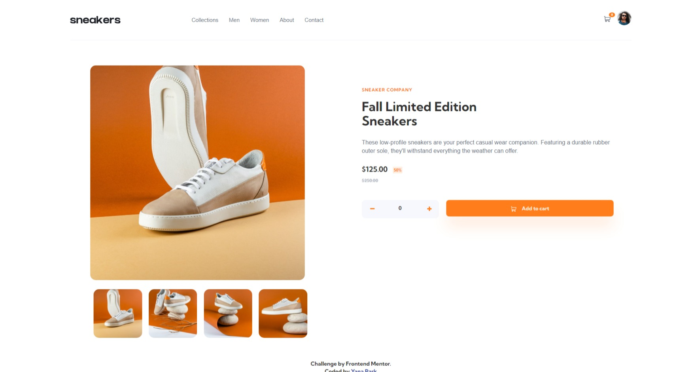

# Project 3 E-commerce Product Page

## Table of contents

- [Overview](#overview)
  - [The challenge](#the-challenge)
  - [Screenshot](#screenshot)
  - [Links](#links)
- [My process](#my-process)
  - [Built with](#built-with)
  - [What I learned](#what-i-learned)
  - [Continued development](#continued-development)
  - [Useful resources](#useful-resources)
- [Author](#author)
- [Acknowledgments](#acknowledgments)

**Note: Delete this note and update the table of contents based on what sections you keep.**

## Overview
This project is to build out this e-commerce product page and get it looking as close to the design as possible.

Users should be able to:
<ul>
<li>View the optimal layout for the site depending on their device's screen size</li>
<li>See hover states for all interactive elements on the page</li>
<li>Open a lightbox gallery by clicking on the large product image</li>
<li>Switch the large product image by clicking on the small thumbnail images</li>
<li>Add items to the cart</li>
<li>View the cart and remove items from it</li>
</ul>

### The challenge

The biggest challenge was creating responsive layout.


### Screenshot




### Links

Live Site URL: (https://yanap73.github.io/Project3_YPark/)

## My process
- First, I created a desktop version of the application. Since it was not a right approach, it was difficult to create a mobile version.
- I started from creating a header which included menu, logo, cart icon, and avatar image. I used Bootstrap for layout.
- Worked on the product description which included images and text.
- Created buttons for adding amount of the product to the cart. 


### Built with

- Semantic HTML5 markup
- CSS custom properties
- Bootstrap
- Flexbox
- CSS Grid
- JavaScript


### What I learned

I learned more HTML, CSS, and JavaScript


<h1>Some HTML code I'm proud of</h1>

 <div id="cartQuantity">
    <a href="javascript:void(0)" class="openCloseCart" onclick="openCloseWindow()">
      </a>
        <span class="quantityInCart">0</span>
  </div>
```
<h1>Some CSS code I'm proud of</h1>
.quantityInCart {
    background-color: var(--orange);
    border-radius: 50%;
    justify-content: center;
    align-items: center;
    font-size: 8px;
    color: white;
    position: absolute;
    top: -5px;
    right: 10%;
    padding: 2px 7px;
}

<h1>Some JavaScript code I'm proud of</h1>
```
```js
function openNav() {
    document.getElementById("mySidenav").style.width = "250px";
}

function closeNav() {
    document.getElementById("mySidenav").style.width = "0";
}
```


### Continued development

I would like to work more on Javascript in the future.


### Useful resources

- [1](https://www.w3schools.com/howto/howto_js_tab_img_gallery.asp-->) - This helped me to create image gallery. 
- [2](https://blog.logrocket.com/create-responsive-mobile-menu-with-css-no-javascript/) - This article helped me understand how to create a responsive mobile menu. 


## Author

- Website - [Yana Park](https://yanap73.github.io/Project3_YPark/)


## Acknowledgments

I really thank my mentor for giving good explanations and giving great tips on how to use CSS, JavaScript, and Bootstrap.


### Technologies Used

<ul>
<li>HTML</li>
<li>CSS</li>
<li>JavaScript</li>
<li>Bootstrap</li>
<li>Git</li>
<li>Github</li>
</ul>
